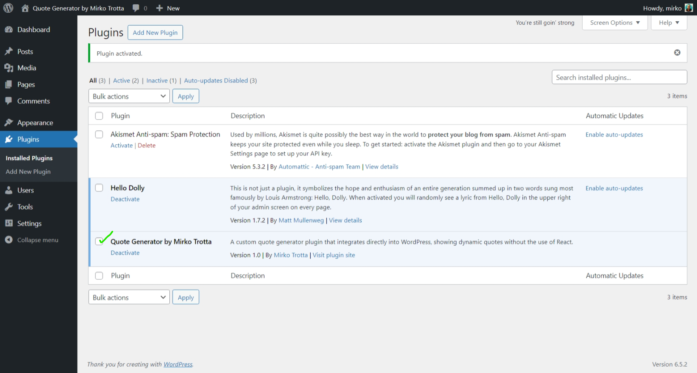

# WordPress Quote Generator Plugin

The WordPress Quote Generator plugin allows you to easily display motivational quotes on your WordPress site using a simple shortcode. Developed originally as a React application, this plugin has been seamlessly integrated into WordPress, showcasing custom plugin development skills.

## Features

- **Simple Integration**: Easily integrates with any WordPress site.
- **Dynamic Quotes**: Randomly displays motivational quotes from a predefined list.
- **Interactive**: Allows users to fetch new quotes without reloading the page.

## Installation

1. Download the plugin from the GitHub repository.
2. Upload the plugin files to the `/wp-content/plugins/` directory, or install the plugin through the WordPress plugins screen directly.
3. Activate the plugin through the 'Plugins' screen in WordPress.
4. Use the shortcode `[quote_generator]` in your posts, pages, or widgets to display the quotes.

## Usage

After installation, add the shortcode `[quote_generator]` to any post, page, or widget where you want the quote generator to appear. Click the "Get New Quote" button to load new quotes dynamically.

## Screenshots

*Initial React app setup.*

*Plugin view in the WordPress admin area.*

*Showing database integration in WordPress.*

## Video Demo

See the plugin in action [here](Screenshots/wp-plugin-in-use-1.mp4).

## License

This project is licensed under the GNU General Public License v3.0 - see the [LICENSE](LICENSE) file for details.

## Contributions

Contributions are what make the open-source community such an amazing place to learn, inspire, and create. Any contributions you make are **greatly appreciated**.

- Fork the Project
- Create your Feature Branch (`git checkout -b feature/AmazingFeature`)
- Commit your Changes (`git commit -m 'Add some AmazingFeature'`)
- Push to the Branch (`git push origin feature/AmazingFeature`)
- Open a Pull Request
